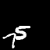

# CMS-LSTM: Context-Embedding and Multi-Scale Spatiotemporal-Expression LSTM for Video Prediction

## Abstract
Extracting variation and spatiotemporal features via limited frames remains an unsolved and challenging problem in video prediction. Inherent uncertainty among consecutive frames exacerbates the difficulty in long-term prediction. To tackle the problem, we focus on capturing context correlations and multi-scale spatiotemporal flows, then propose CMS-LSTM by integrating two effective and lightweight blocks, namely Context-Embedding (CE) and Spatiotemporal-Expression (SE) block, into ConvLSTM backbone. CE block is designed for abundant context interactions, while SE block focuses on multi-scale spatiotemporal expression in hidden states. The newly introduced blocks also facilitate other spatiotemporal models (e.g., PredRNN, SA-ConvLSTM) to produce representative implicit features for video prediction. Qualitative and quantitative experiments demonstrate the effectiveness and flexibility of our proposed method. We use fewer parameters to reach markedly state-of-the-art results on Moving MNIST and TaxiBJ datasets in numbers of metrics. All source code is available at https://github.com/czh-98/CMS-LSTM.


## Results

<div>
    <table width="600" border="0px">
      <tr>
        <th width="100">(Real)</th>
        <th width="100">Ours</th>
        <th width="100">PredRNN</th>
        <th width="100">PredRNN++</th>
        <th width="100">MIM</th>
        <th width="100">SA-LSTM</th>
      </tr>
    </table>
    
    
    
    
    
    
</div>
<div>
    
    
    
    
    
    
</div>


## Datasets
<!-- ## Pre-trained Models and Datasets -->
<!-- Pretrained Model will be released soon! -->
Dataset for Moving MNIST is avilliable in:

For train dataset:

http://yann.lecun.com/exdb/mnist/train-images-idx3-ubyte.gz

For test datset

http://www.cs.toronto.edu/~nitish/unsupervised_video/mnist_test_seq.npy

## Setup
All code is developed and tested on a Nvidia RTX2080Ti the following environment.

- Python 3.8.5
- h5py 2.10.0
- imageio 2.9.0
- numpy 1.19.4
- opencv-python 4.4.0.46
- pandas 1.1.5
- pillow 8.0.1
- scikit-image 0.17.2
- scipy 1.5.4
- torch 1.7.1
- torchvision 0.8.2
- tqdm 4.51.0

## Train
Use the `scripts/train.sh` script to train the model. To train the default model on Moving MNIST simply use:
```shell
cd scripts
sh train.sh
```
You might want to change the `--data_root` which point to paths on your system of the data.

```
CUDA_VISIBLE_DEVICES=0 \
python train.py \
--model 'cmslstm' \
--dataset 'mmnist' \
--data_root './data/Moving_MNIST' \
--lr 0.001 \
--batch_size 8 \
--epoch_size 200 \
--input_nc 1 \
--output_nc 1 \
--load_size 720 \
--image_width 64 \
--image_height 64 \
--patch_size 4 \
--rnn_size 64 \
--rnn_nlayer 4 \
--filter_size 3 \
--seq_len 10 \
--pre_len 10 \
--eval_len 10 \
--criterion 'MSE' \
--lr_policy 'cosine' \
--niter 5 \
--total_epoch 2000 \
--data_threads 4 \
--optimizer adamw
```

<!-- ## BibTeX
TODO -->

## Questions
If you have any questions or problems regarding the code or paper do not hesitate to contact us.